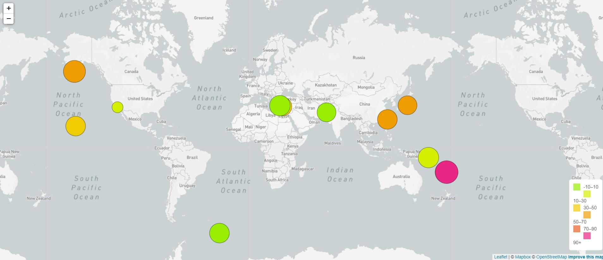
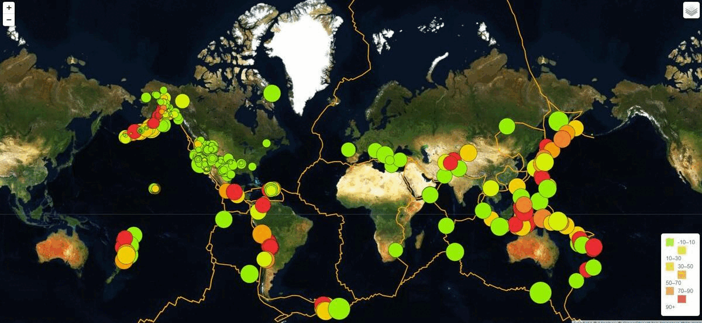

# leaflet-challenge

The goal of the project is to display multiple and interactive maps with the location and magnitude of earthquakes during the last 7 days around the world. 

The Javascript-Leaflet library, HTML, CSS, Bootstrap, and Javascript were used in the project. The Mapbox-API was also used to load the base maps. 

The project was divided into two steps with different levels of complexity.

## Step 1: A single base layer and one set of data were used

Base layer: mapbox.greyscale  
Data Layer Source: United States Geological Survey (USGS) 
Data: All Earthquakes for the last 7 days 

## Step 2: Map to illustrate the relationship between tectonic plates and seismic activity
Multiple optional and interactive base layers were included. 

An additional dataset and plot were included and they can be activated and deactivated by the user.
Data markers reflects the magnitude of the earthquake by their size and and depth of the earth quake by color. 
Earthquakes with higher magnitudes should appear larger and earthquakes with greater depth should appear darker in color.
The map includes popups that provide additional information about the earthquake when a marker is clicked.
Legends created that will provide context for the map data.

Base layer:
- mapbox.greyscale
- mapbox.satellite
- mapbox.outdoors

Data: All Earthquakes - Last 7 days  
Layer 2: Tectonic Plates  
Source: Hugo Ahlenius, GIS-and-Cartography Consultant https://github.com/fraxen/tectonicplates
Libraries Required (already included in the index.html file)
D3 JavaScript, Leaflet

## Instructions Steps

- Download or clone all the files contained in this repo.
- Create a Mapbox Token
- Include your Mapbox Token in the /Leaflet-Step-1/static/js/config.js and /Leaflet-Step-2/static/js/config.js files.
- Run a python -m http.server or any other method for this purpose.
- Load the Leaflet-Step-1/index.html and Leaflet-Step-2/index.html files.

